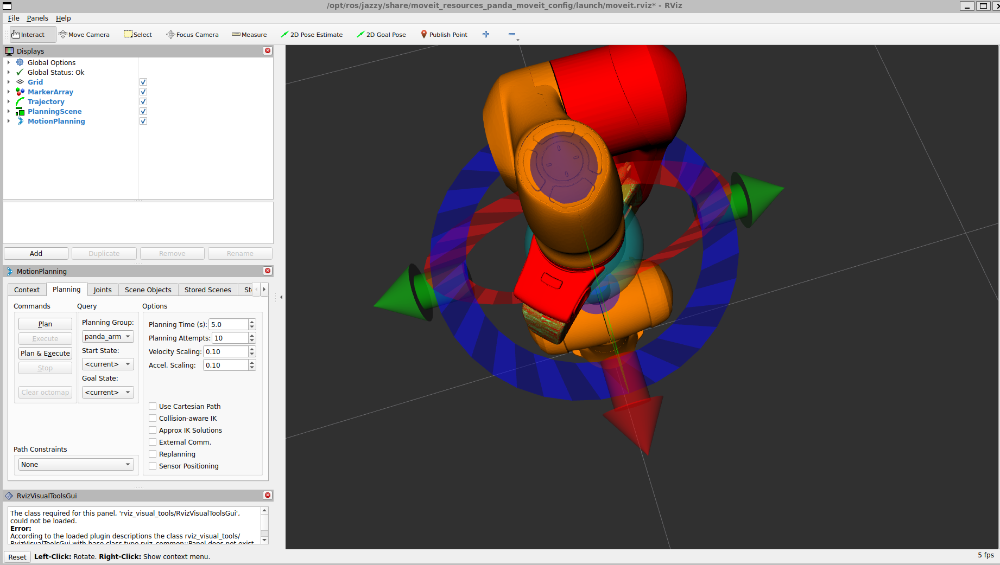
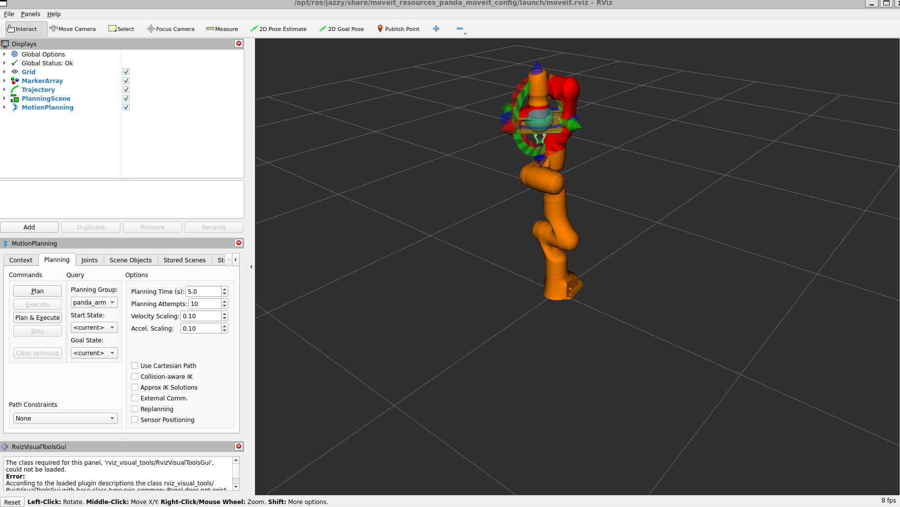

# Robotic Arm Project

## Overview

This project demonstrates robotic motion planning using ROS2 Jazzy, MoveIt2, and MoveItPy.

The project provides a modular Python API for robotic manipulation and currently supports motion planning to named robot configurations and Cartesian target positions.

This repository is being developed as a professional robotics portfolio project.

---

## Technologies

* ROS2 Jazzy
* MoveIt2
* MoveItPy
* Python
* RViz2
* Ubuntu 24.04
* OMPL Motion Planner

---

## Features

* Motion planning
* Named robot configurations
* Cartesian target planning
* Collision-aware planning
* Modular robot API
* RViz visualization

---

## Screenshots

### Robot Loaded

### Motion Planning

(Add screenshot here.)

### Pick-and-Place Planning Pipeline

---

## Current Progress

* Motion planning with MoveItPy
* Cartesian goal planning
* Named configuration planning
* RViz visualization
* Modular project structure

---

## Future Work

* Scene management
* Collision objects
* Pick-and-place
* Gripper control
* Gazebo simulation
* Camera integration
* Object detection
* Pick-and-place planning pipeline
* Multi-step robotic motion sequence

---

## Author

**Benedicta Nzekwe**

Computer Science Student

Philander Smith University
